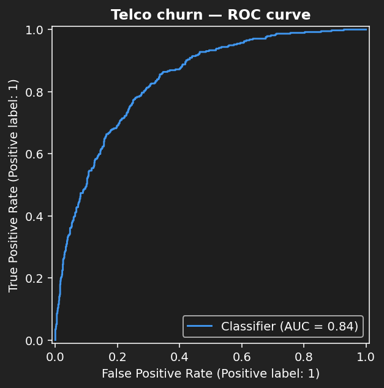
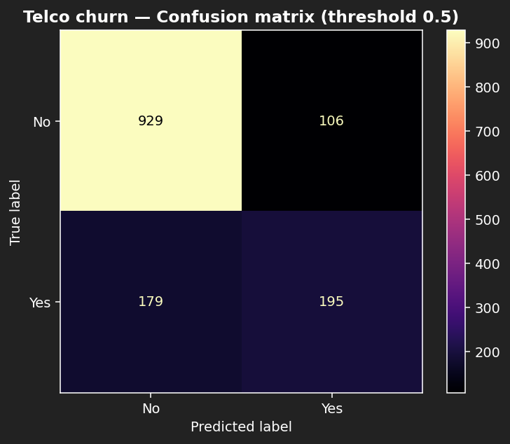
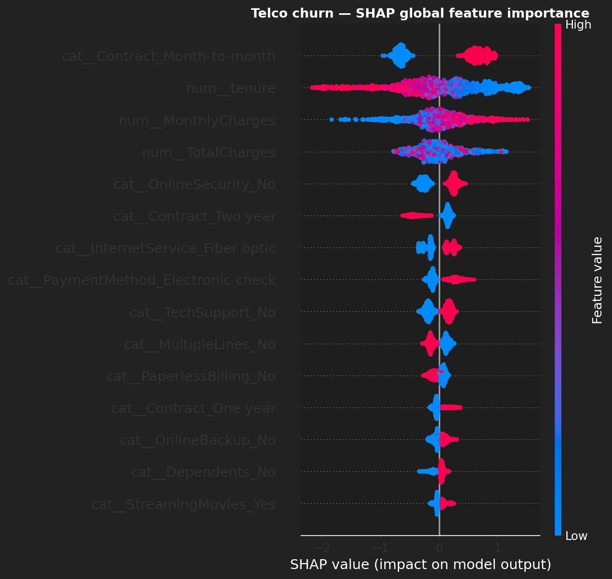

# Telco Customer Churn — XGBoost Classifier

Predicts customer churn from a public Telco dataset. End-to-end: preprocessing pipeline, XGBoost training, ROC-AUC + confusion matrix evaluation, **SHAP explainability**, and a live Streamlit demo.

## Quick links

- 🚀 **[Live demo (Streamlit)](https://syrine-churn.streamlit.app](https://churn-classifier-nk8qxgpsbeh8akhk3luqwu.streamlit.app/)](https://churn-classifier-nk8qxgpsbeh8akhk3luqwu.streamlit.app/))** — drag sliders, see predictions update.
- 📋 **[Model card](MODEL_CARD.md)** — what / why / caveats.
- 🧪 **[Training script](src/train.py)** — runs in ~3 seconds on a laptop.

## Results (20% stratified holdout)

| Metric | Value |
|---|---|
| ROC-AUC | **0.842** |
| PR-AUC (Avg Precision) | 0.652 |
| Accuracy @ τ=0.5 | 0.81 |
| Recall on churn class | 0.55 |

 

## Top features (mean \|SHAP\|)

1. `tenure`
2. `Contract = Month-to-month`
3. `InternetService = Fiber optic`
4. `MonthlyCharges`
5. `PaymentMethod = Electronic check`



## Stack

`scikit-learn` (Pipeline + ColumnTransformer) · `xgboost` · `shap` · `streamlit` · `pandas` / `numpy` · `matplotlib` / `seaborn`.

## Run it

```bash
git clone https://github.com/SyrineLarbi/churn-classifier
cd churn-classifier
python3 -m venv .venv && source .venv/bin/activate
pip install -r requirements.txt

curl -L -o data/raw/Telco-Customer-Churn.csv \
  https://github.com/IBM/telco-customer-churn-on-icp4d/raw/master/data/Telco-Customer-Churn.csv

python -m src.train       # → artifacts/model.pkl + metrics.json + ROC + confusion plots
python -m src.explain     # → SHAP summary, bar, waterfall
streamlit run app.py      # → http://localhost:8501
